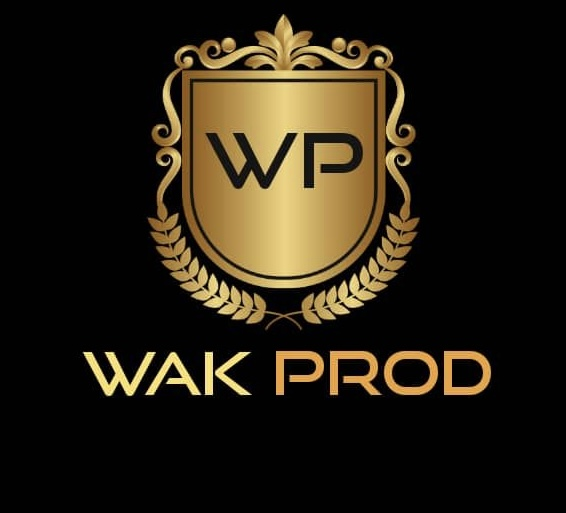

# my-portfolio[Uploading Abo<!DOCTYPE html>[Uploading St@import url('https://fonts.googleapis.com/css2?family=Poppins:,wght@400;600,700&display=swap');[Uploading i<!DOCTYPE html>
<html lang="en">
<head>
    <meta charset="UTF-8">
    <meta http-equiv="X-UA-Compatible" content="IE=edge">
    <meta name="viewport" content="width=device-width, initial-scale=1.0">
    <link
        href="https://cdn.jsdelivr.net/npm/remixicon@3.2.0/fonts/remixicon.css"
        rel="stylesheet" 
    />
    <link rel= "stylesheet" href="styles.css"/>
    <link href="AboutMe.html"/>
    <title> Kazadi Web Design | Responsive Portfolio</title>
</head>
<body>
    <nav>
        

        
<a href="#">Wakprod</a> 

        <label for="check" class="checkbox">
            <i class="ri-menu-line"></i>
        </label>
        <input type="checkbox" name="check" id="check">
        <ul>
            <li><a href="#">Home</a> </li>
            <li><a href="AboutMe.html"> About Me</a></li>
            <li><a href="#">My Resume</a> </li>
            <li><a href="#">Portfolio</a> </li>
            <li><a href="#">Contact us</a> </li>
        </ul>
    
 
</nav>
<section class="section">
    

        

            
Hello

            <h1 class="title">
                 
                 
              I'm Kazadi a Web Developer  
            </h1>
            

              Welcome to my portfolio! I am Kazadi J, a founder of Wakprod.LLC 
              Entertainment since 2017.  
            

            

              <button class="hire__me">Hire Me</button>
              <button class="portfolio">Portfolio</button> 
            

        

         
        

            

        

    

</section>

    

    
</body>
</html>ndex.html…]()

:root {
    --primary-color: #1f2937;
    --primary-color-dark: #1f2937;
    --secondary-color: #312306;
    --text-dark: #1f2937;
    --text-light: #6b7280;
    --extra-light: #000000;
    --max-width: 1400px;
}

*{
    padding:0;
    margin:0;
    box-sizing: border-box;
}

a{
    text-decoration: none;
}

body{
    font-family: "Poppins", sans-serif;
}

nav{
    width: 100%;
    position: fixed;
    top: 0;
    left:0;
    background-color:rgb(207, 147, 67);
    z-index: 99;
}

.nav__content{
    max-width: var(--max-width);
    margin: auto;
    padding: 1.5rem 1rem;
    display: flex;
    align-items: center;
    justify-content: space-between;
}

nav .logo a{
    font-size: 1.5rem;
    font-weight: 600;
    color: var(--primary-color);
    transition: .10s;
}
nav .logo a:havor {
    color: var(--primary-color-dark);
}
nav .checkbox{
    display: none;
}

nav input{
  display: none;  
}
nav .checkbox i{
    font-size: 2rem;
    color: var(--primary-color);
    cursor: pointer;
}

ul{
    display: flex;
    align-items: center;
    gap: 1rem;
    list-style: none;
    transition: left 0.3s;
}

ul li a {
    padding: 0. 5rem 1rem;
    border: 2px solid transparent;
    text-decoration: none;
    font-weight: 600;
    color: var(--text-dark);
    transition: 0.3s;
}

ul li a:hover{
    border-top-color: var(--secondary-color);
    color: var(--secondary-color);
}

.section{
    background-color: var(--extra-light);
}

.section__container{
    min-height: 100vh;
    max-width: var(--max-width);
    margin: auto;
    padding: 1rem;
    display: grid;
    grid-template-columns: repeat(2, 1fr);
    gap: 4rem;

}

.content{
    display:flex;
    flex-direction: column;
    justify-content: center;
}

.subtitle{
    letter-spacing: 2px;
    color: var(--text-light);
    font-weight: 600;
    margin-bottom: .5rem;
}

.title{
    font-size: 2.5rem;
    font-weight: 400;
    line-height: 3rem;
    color: var(--text-dark);
    margin-bottom: 1rem;
}

.title span{
    font-weight: 600;
}

.description{
    line-height: 1.5rem;
    color: var(--text-light);
    margin-bottom: 2rem;
}

.action__btns{
    display: flex;
    gap: 1rem;
}

.action__btns button{
    font-size: 1rem;
    font-weight: 600;
    letter-spacing: 2px;
    padding: 1rem 2rem;
    outline: none;
    border: 2px solid var(--primary-color);
    border-radius: 10px;
    transition: 0.3s;
    cursor: pointer;
}

.hire__me {
    background-color: var(--primary-color);
    color:blanchedalmond;
}

.hire__me:hover {
    background-color: var(--primary-color-dark);
    
}

.portfolio {
    color: var(--primary-color);
}

.portfolio:hover {
    background-color: var(--primary-color-dark);
    color:blanchedalmond;
}

.image {
    display: grid;
    place-items: center;
}

.image img {
    width: min(25rem, 90%);
    border-radius: 100%;
}

@media (width < 750px) {
    nav .checkbox{
        display: block;
    }

    ul{
        positon: absolute;
        width: 100%;
        height: calc(100vh - 85px);
        left: -100%;
        top: 85px;
        background-color: var(--extra-light);
        flex-direction: column;
        justify-content: center;
        gap: 3rem;
    }

    nav #check:checked ~ ul{
        left:0;
    }

    ul li a {
        font-size: 1.25rem;
    }

    .section__container{
        padding: 10rem 1rem 5rem 1rem;
        text-align: center;
        grid-template-columns: repeat(1, 1fr);
    }

    .image{
        grid-area: 1/1/2/2;
    }

    .action__btns{
        margin:auto;
    }

    img {
        border-radius: 50%;
    }
}yles.css…]()

<html lang="en">
<head>
    <meta charset="UTF-8">
    <meta http-equiv="X-UA-Compatible" content="IE=edge">
    <meta name="viewport" content="width=device-width, initial-scale=1.0">
    <link
        href="https://cdn.jsdelivr.net/npm/remixicon@3.2.0/fonts/remixicon.css"
        rel="stylesheet" 
    />
    <link rel= "stylesheet" href="styles.css"/>
    <link href="AboutMe.html"/>
    <title> Kazadi Web Design | Responsive Portfolio</title>
</head>
<body>
    <nav>
        

        
<a href="#">Wakprod</a> 

        <label for="check" class="checkbox">
            <i class="ri-menu-line"></i>
        </label>
        <input type="checkbox" name="check" id="check">
        <ul>
           
        </ul>
    
 
</nav>
<section class="section">
    

        

            
Hello

            <h1 class="title">
                 
                 
               <bra ABOUT US
            </h1>
            

              WakProd.LLC Ent was found in 2017 by DJ Wakanda. With a passion for crafting
              dynamic sets across diverse genre, DJ Wakanda brings infectious energy to every event, seamlessly
              bleding crowd favorites with fresh discoveries to keep the dance floor alive.
              With years of experience in Weddings, Birthdays, Graduations events, DJ Wakanda is known
              for reading the room and delivering a personalized experience that gets people moving. 
            

            
        

         
        

            
             
             
            
            
           
        

    

</section>
</body>
</html>utMe.html…]()

